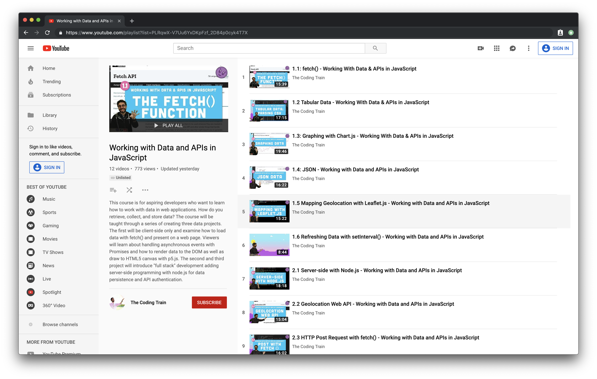

# The Weather Here

This is a web application that gets your location data and pass that data to an express server. On the server, the server queries the Dark Sky API (weather) and OpenAQ (open air quality) database for pollution data near the given coordinates. You can view your checkins and a short "story" written from the contextual data collected from the application. This includes data on the weather, your location, and the pollution in that area if measurements are available.

It is available at [CodingTrain/The Weather Here](https://codingtrain-the-weather-here.glitch.me/checkins/)

This version is based on the original sample project [The Weather Here](https://github.com/joeyklee/the-weather-here) by [Joey Lee](https://jk-lee.com/work/) for the ITP course [Quant Humanists](https://github.com/joeyklee/quant-humanists-2019).

To build this project you can follow a [full set of video tutorials on The Coding Train](https://www.youtube.com/playlist?list=PLRqwX-V7Uu6YxDKpFzf_2D84p0cyk4T7X).

